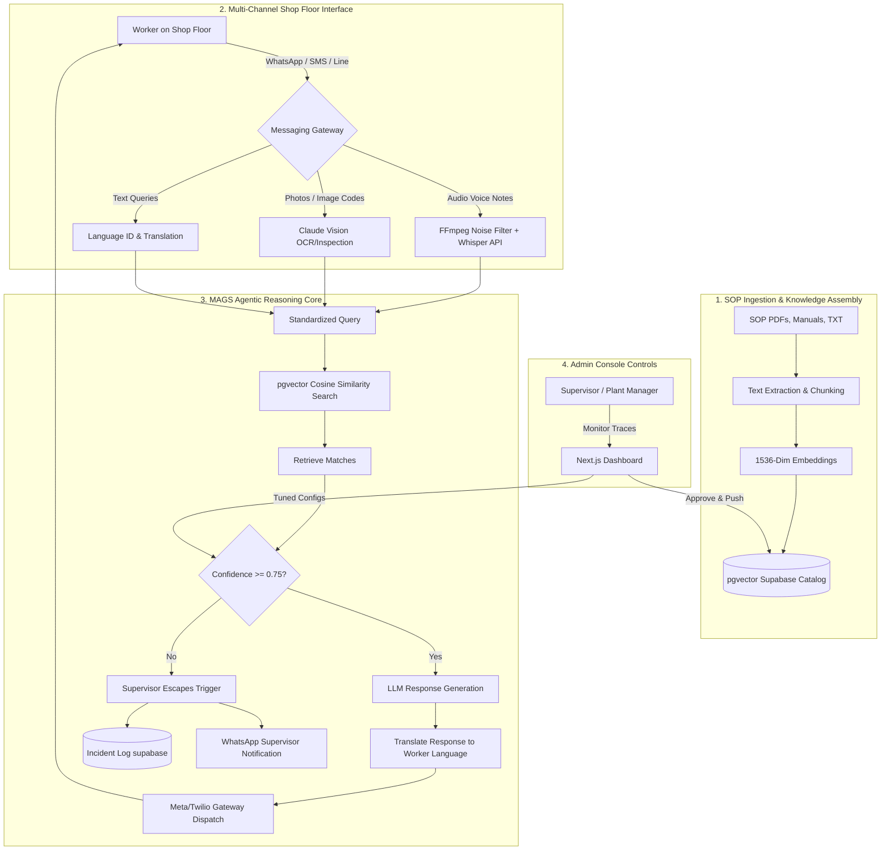

# MAGS.ai — Frontline AI Platform

**MAGS.ai** is an agentic, multi-channel AI platform tailored for frontline industrial operations, particularly targeting India's 500M factory workers. The platform bridges the gap between complex standard operating procedures (SOPs) and workers on the shop floor via WhatsApp, Twilio SMS, and Line, enabling zero-training voice, text, and visual interactions in native languages.

---

## 🏗️ System Architecture

MAGS.ai runs on a Retrieval-Augmented Generation (RAG) loop featuring real-time language translation, semantic matching, automatic supervisor escalation, and incident logging.



### Flow Breakdown
1. **Ingestion**: SOP documents are parsed, chunked, and embedded into a `pgvector` database.
2. **Gateway Reception**: Frontline workers send a message (text, voice, or photo of warning lights).
3. **Reasoning Loop**: 
   - Audio is filtered of machinery noise and transcribed.
   - Text is matched against the vector base.
   - If semantic confidence is **high (>= 0.75)**, the agent generates a grounded instruction, translates it, and replies.
   - If confidence is **low (< 0.75)**, the query is flagged, an incident log is created, and the duty supervisor is notified.

---

## 🌟 Key Features

- **Tactile Multi-Channel Phone Simulator**: An interactive phone interface on the landing page showcases real-time WhatsApp, Twilio, and Line behaviors in Hindi, Spanish, and Vietnamese.
- **RAG Reasoning Visualizer**: Watch the agentic thought traces, confidence score evaluations, database caches, and tool call logs execute step-by-step.
- **Interactive SOP Upload & Drafting**: Drop new SOPs into the admin console and watch the simulator upload, chunk, and embed the files. Approve automated documentation drafts created by Claude based on unanswered worker logs.
- **Incident Resolution Ledger**: Track and resolve incidents created by low-confidence overrides or emergency alerts.
- **Global Dark Mode**: Full theme state persistence and header toggles across the landing page, subpages, and admin console.
- **tactile UI Details**: High-fidelity custom interlocking SVG branding logo, reflective gradient shimmer buttons, and spring-like micro-scale click haptic feedback.

---

## 🛠️ Tech Stack

- **Frontend**: Next.js (App Router), TypeScript, Vanilla CSS (dynamic variable styling).
- **Simulated Infrastructure**: pgvector vector indexing, OpenAI Whisper transcription, Claude Vision status tags, and Sarvam AI translations.
- **State Management**: React Hooks with local storage theme persistence.

---

## 🚀 Getting Started

### Prerequisites
- Node.js (v18 or higher)
- npm or yarn

### Installation
1. Clone the repository:
   ```bash
   git clone https://github.com/ashutoshpandey18/Harness.git
   cd Harness
   ```

2. Install dependencies:
   ```bash
   npm install
   ```

3. Run the development server:
   ```bash
   npm run dev
   ```

4. Open [http://localhost:3000](http://localhost:3000) to view the application.

---

## 📄 License
This project is proprietary and confidential. © 2026 MAGS.ai. All rights reserved.
